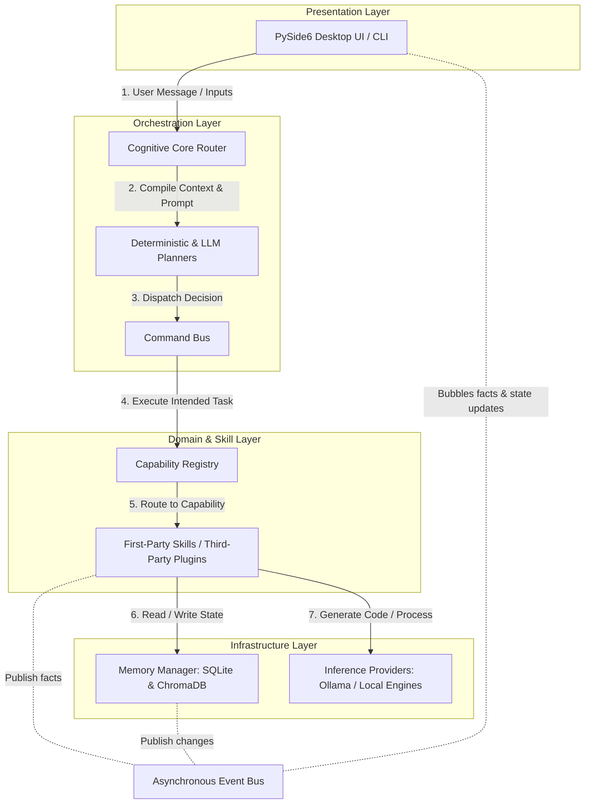

# VulcanAI

An AI Operating System designed to become a persistent, local-first, modular artificial intelligence companion.

---

## Vision

Vulcan is not a chatbot. It is not an LLM wrapper. It is an **AI Operating System**.

Traditional AI tools are built as stateless, cloud-dependent interfaces that treat the user as a passive consumer and the computer as a series of disconnected API calls. Vulcan is engineered to invert this paradigm.

As a local-first, privacy-respecting, and highly modular system, Vulcan functions as a persistent digital companion. It coordinates memory, tools, and execution streams through a clean, interface-driven desktop architecture. By separating reasoning from presentation and running models locally, Vulcan aims to become a lifelong learning system that can safely automate complex workflows while keeping the user in absolute control.

---

## What Vulcan Is Not

To establish clear technical expectations and maintain engineering focus, we define what Vulcan is explicitly designed *not* to be:

*   **Not a Cloud Chatbot:** Vulcan operates on your local machine. It does not send your data, conversation logs, or codebase files to remote servers without your explicit, opt-in permission.
*   **Not a Replacement for Human Judgment:** Vulcan is designed as an agent of assistance, not an unaccountable surrogate. It proposes plans, but does not perform critical state-altering operations outside its designated sandbox without human validation.
*   **Not an AGI Project:** We make no claims of creating sentient artificial general intelligence. Vulcan is a highly structured, deterministic orchestration system that utilizes specialized local language models as reasoning coprocessors.
*   **Not a Monolithic Black Box:** Every major component—from the vector database and database engines to the visual layout and LLM providers—is strictly decoupled behind clear, stable abstract interfaces.
*   **Not Tied to a Single Model Provider:** While Ollama is integrated as a local default, Vulcan is model-agnostic and relies on unified inference contracts rather than proprietary API client SDKs.

---

## Why Vulcan Exists

Current AI assistants suffer from fundamental architectural limitations:

1.  **Stateless Conversations:** Dialogue context is lost as soon as a session ends, preventing true personalization or long-term collaboration.
2.  **Cloud Dependence:** Relying on third-party APIs exposes sensitive user data to security breaches, creates vendor lock-in, and renders the assistant useless when offline.
3.  **Poor Personalization:** Without access to a safe, private "second brain," models cannot understand the user's ongoing projects, preferences, or technical history.
4.  **Fragile Autonomy:** Standard agent platforms rely on brittle scripting loops that run blind shell commands, risking severe local filesystem damage and failing to provide explainability.
5.  **Fragmented Tooling:** Users must jump between disconnected CLI tools, browser extensions, and web-based chat panels to accomplish a single workflow.

### The Vulcan Solution

Vulcan addresses these problems directly by introducing a formal **Cognitive Architecture**:
*   A **Unified Cognitive Loop** that guarantees every interaction passes through structured context gathering, deterministic planning checks, and permission-gated capability routing.
*   A **Multi-Domain Memory Manager** that separates short-term working state from permanent knowledge, historical logs, and the user’s personal Obsidian-backed notebook.
*   A **Decoupled Messaging Infrastructure** using an asynchronous Event Bus for system-wide notifications and a synchronous Command Bus for strict instruction-handler routing.
*   A **Local-First Ecosystem** built on open technologies like Ollama and PySide6, ensuring complete offline availability, deterministic latency, and rock-solid privacy.

---

## Design Philosophy

Vulcan is engineered for longevity. The codebase is guided by a core set of design principles:

*   **Local-First AI:** Privacy is non-negotiable. Personal files, system contexts, and conversation histories are processed and stored locally. Cloud-based model providers are treated strictly as secondary, optional integrations.
*   **User Ownership of Data:** The user's external data is sacred. Vulcan treats personal knowledge repositories (such as Obsidian vaults) with absolute care, reading context defensively and never overwriting or restructuring personal files without explicit authorization.
*   **Interface-Driven Contractualism:** Implementations must depend strictly on stable abstract contracts prefixed with `I` (e.g., `IEventBus`, `IInferenceProvider`, `IMemoryManager`). Direct concrete imports across structural boundaries are strictly forbidden, ensuring any component can be completely swapped without side effects.
*   **Strong Separation of Concerns:** The application enforces an inward-flowing layer rule: `Presentation Layer → Orchestration Layer → Domain Layer → Infrastructure Layer`. Presentation components contain zero business, planning, or inference rules, and core domain modules have absolutely zero dependencies on GUI or database libraries.
*   **Decoupled Command and Event Flows:** Instructions and notifications are strictly isolated. Commands represent intentional requests (*what should happen*) routed to a single handler, while Events represent completed facts (*what already happened*) distributed to zero or more observers.
*   **Explicit Documentation & Governance:** Every architectural choice is recorded using a formal decision template. The codebase does not evolve through ad-hoc refactoring; it follows the rules established in the Constitution, the Vulcan Architecture Specification, and formal Architecture Decision Records (ADRs).
*   **Long-Term Maintainability over Rapid Feature Growth:** We prioritize structural stability, extensive type safety, and thorough unit and visual test coverage over rushing out fragile autonomous features.

---

## Core Principles (The Constitution Summary)

The supreme law of Vulcan is established in its companion document, the **Constitution of the Vulcan AI Operating System**. It defines immutable laws that govern every code change and capability:

1.  **Ultimate User Sovereignty:** The user is the absolute authority. No autonomous proposal can execute state-altering changes without explicit, transparent, and reversible user consent.
2.  **Absolute Privacy:** User data belongs solely to the user. No sensitive context can be transmitted to external services without informed permission.
3.  **Explainability by Default:** The user has the right to understand *why* the system or an agent proposed an action, what information was utilized, and how a decision was formulated.
4.  **Defensive Integration & Resilience:** External services and local model providers are integrated defensively. If Ollama or an external plugin goes offline, Vulcan must degrade gracefully without crashing.
5.  **Memory Domain Integrity:** Memory is never treated as a single monolith. It is strictly partitioned into non-overlapping functional domains (Working, Identity, Experience, Knowledge, Reflection, Development, and User Memory) to prevent context contamination and silent pruning.
6.  **Permission-Gated Capability Routing:** Agents do not run arbitrary code. They must request specific, schema-validated capabilities (e.g., `filesystem.read`) declared in their manifests and verified against security parameters.

---

## Architecture

At a high level, Vulcan is organized into clean, vertical layers that govern how user requests flow down to capabilities and how system responses bubble back up to the interface:



### Vertical Layer Responsibilities

1.  **Presentation Layer:** Coordinates window management, desktop layouts, and PySide6 visual components. It remains extremely thin, dispatching intents through the Command Bus and subscribing to system-wide events via the Event Bus.
2.  **Cognitive Core:** Houses the central reasoning pipeline. It manages active sessions, coordinates pluggable context providers, builds safe prompt documents, and routes intermediate actions.
3.  **Planner:** Evaluates requests against a deterministic rule engine first (to instantly catch diagnostics, empty strings, and shutdown commands), falling back to structured LLM classification when necessary.
4.  **Command Bus:** Decoupled execution router that maps specific instructions (like executing a filesystem read or checking capability availability) to a single registered executor.
5.  **Capabilities / Skills:** Independent functional packages (e.g., Git, Terminal, Browser, Calendar) declaring strict schemas, required permissions, and manifest files.
6.  **Infrastructure:** Low-level adapters wrapping database file systems (SQLite), vector-embedding indexes (ChromaDB), and local LLM runtime interfaces (Ollama provider).

---

## Current Development Status

The development of Vulcan is organized into consecutive, highly-structured phases designed to build a stable platform before exposing highly autonomous or self-improving agents.

*   **Phase 0 — Architectural Foundation** |  ✅ Completed
*   **Phase 1 — Cognitive Core** |  ✅ Completed
*   **Phase 2 — Memory & Context** |  🚧 In Progress
*   **Phase 3 — Skills & Capability Framework** |  ⬜ Planned
*   **Phase 4 — Voice Interface** |  ⬜ Planned
*   **Phase 5 — Planning & Workflows** |  ⬜ Planned
*   **Phase 6 — Multi-Agent System** |  ⬜ Planned
*   **Phase 7 — Development Agent** |  ⬜ Planned
*   **Phase 8 — Autonomous Improvement** |  ⬜ Planned
*   **Phase 9 — AI Operating System** |  ⬜ Planned

For exhaustive details on milestones, success criteria, and deliverables for each phase, see the master development plan in [ROADMAP.md](ROADMAP.md).

---

## Repository Structure

The Vulcan codebase is contained under a single, unified root namespace, with each subdirectory mapped to a specific architectural layer:

```
vulcan/
├── agents/        # Abstract agent models, lifecycle controllers, and tool specifications
├── cognition/     # Cognitive Core: session manager, prompt builders, planners, and cognitive routers
├── config/        # Layered configuration loaders with environment overrides and validation
├── core/          # Composition root: service container, command bus, event bus, registry loaders
├── events/        # Structured, schema-validated Pydantic models for system events
├── memory/        # Multi-domain memory contracts, SQLite relational stores, and Vector wrappers
├── services/      # Concrete infrastructure providers (e.g., local Ollama httpx adapters, ChromaDB clients)
├── skills/        # First-party capability modules (e.g., local filesystem access)
├── ui/            # Presentation Layer: PySide6 windows, custom dockable panels, layout controllers
└── utils/         # Structured Loguru utility loggers and helper functions
```

---

## Documentation

Vulcan enforces a rigorous documentation hierarchy located in `docs/architecture/`. Contributors are expected to read and adhere to these documents before proposing changes:

*   **[The Constitution](docs/architecture/Constitution.md):** The supreme philosophical and ethical law of Vulcan. Every future feature, capability registration, and user-agent interaction must conform strictly to these core values.
*   **[Vulcan Architecture Specification (VAS)](docs/architecture/Vulcan_Architecture_Specification.md):** The single authoritative source of truth for architectural requirements, packages, threading boundaries, and software interfaces.
*   **[Architecture Decision Records (ADRs)](docs/architecture/adr/):** A chronological collection of design documents recording key design choices, options weighed, tradeoffs made, and future architectural consequences.
*   **[Glossary](docs/architecture/Glossary.md):** The single-source registry of architectural terminology and definitions.

---

## Technology Stack

Our engineering stack is chosen strictly for local performance, extreme reliability, and structural type-safety:

*   **Core Language:** Python (3.10+) for rapid system-level integration, robust asynchronous handling, and standard library interfaces.
*   **Desktop Interface:** PySide6 (Qt for Python) to construct fluid, 60 FPS visual environments utilizing dockable panels and native layout persistence.
*   **Local LLM Orchestration:** Ollama using non-blocking, asynchronous HTTP clients for robust, local inference.
*   **Relational Storage:** SQLite (accessed via the standard library `sqlite3` directly to ensure zero dependency overhead and strict query control) for historical timelines, sessions, and logs.
*   **Vector Database:** ChromaDB to store and retrieve semantic knowledge representations and contextual embeddings locally.
*   **Data Validation:** Pydantic for strong typing, compile-time and runtime model checking, and declarative schemas.
*   **Static Quality & Linting:** Ruff, Black, and MyPy to guarantee consistent styling, eliminate dead code, and enforce comprehensive static typing across all modules.
*   **Verification:** Pytest and Pytest-Qt to provide thorough unit, integration, and mock graphical testing.

---

## Long-Term Vision (5+ Years)

In five years, Vulcan aims to become a fully mature, open-source AI desktop operating system that redefines how humans interact with local computing hardware.

*   **A Natural Voice Interface:** A low-latency, voice-first desktop companion capable of background activity detection, real-time streaming text-to-speech, and localized wake word orchestration.
*   **The Ultimate Dev Agent:** A secure, sandboxed, autonomous coding assistant that can run isolated test suites, perform static code analysis, resolve issues on its own branch, and submit clean pull requests to its human maintainer.
*   **Multi-Agent Coordination:** A network of specialized, local agents collaborating on complex projects—such as automated research, database auditing, and software refactoring—all coordinated through shared memory context.
*   **A Lifelong Second Brain:** An integrated knowledge manager that synthesizes user logs, local file histories, and digital libraries over months and years, constructing deeply personalized, local reflection indexes without compromising user privacy.

Vulcan will not be another application on your computer. It will become a unified, highly adaptable, and transparent intelligence environment that serves as an extension of your own mind.

---

## Contributing

We welcome contributions from engineers who value structural clean-code practices, interface-first design, and rigorous system architecture.

When contributing:
1.  **Read the Constitution & VAS:** Ensure your proposed implementation aligns with user sovereignty, strict threading boundaries, and layer separation.
2.  **Use Constructor Injection:** Avoid calling service locators inside domain logic. Define dependencies clearly in constructors.
3.  **Ensure Strict Typing:** All new files must pass `mypy` strict check, contain robust docstrings, and follow `black` and `ruff` standards.
4.  **Write Comprehensive Tests:** Every bug fix or feature must include corresponding unit tests in the `tests/` directory. Visual widget modifications must include `pytest-qt` verification.
5.  **Submit an ADR:** For significant architectural modifications, write a new ADR using the template provided in `docs/architecture/adr/template.md`.

For a step-by-step setup guide and local environment installation commands, consult the [Setup Guide](docs/setup_guide.md).

---

## License

Vulcan is licensed under the **MIT License**. We are fully committed to keeping Vulcan open-source, community-driven, and permanently accessible to individuals everywhere.

---

## Acknowledgements

Vulcan is built on the shoulders of the extraordinary open-source software and artificial intelligence communities. We sincerely acknowledge the tools and technologies that make this project possible:

*   **Python:** The core language of system integration.
*   **PySide6:** Bringing powerful, responsive native desktop visual structures to python.
*   **Ollama & Qwen Teams:** Enabling robust, offline, high-speed LLM reasoning on developer workstation hardware.
*   **Pydantic:** Raising the standard for type safety and runtime schema checking.
*   **ChromaDB & SQLite:** Providing light-weight, reliable semantic and relational persistence.
*   **The Open-Source Testing Stack:** Pytest, Pytest-Qt, Ruff, Black, and MyPy for maintaining elite engineering standards.
*   **The Global AI Community:** Empowering independent developers to build local-first, privacy-respecting cognitive systems.
