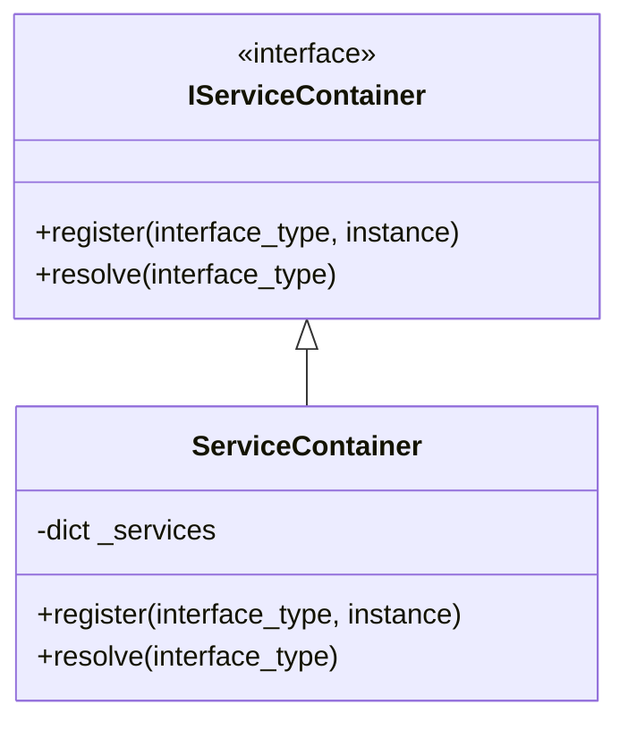
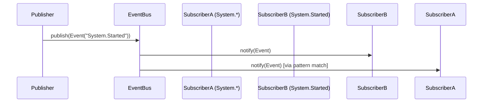
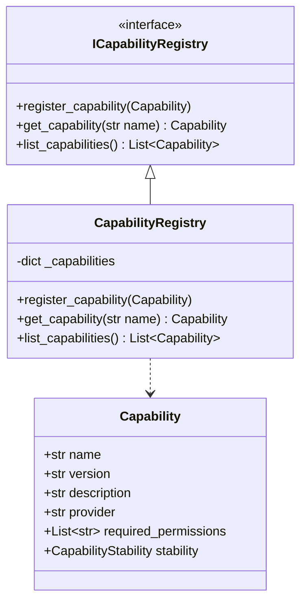
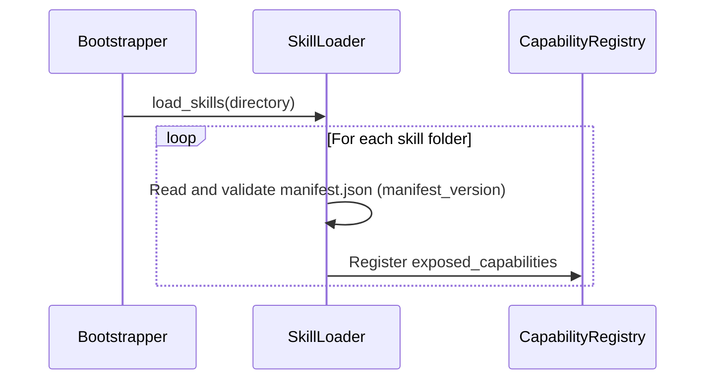
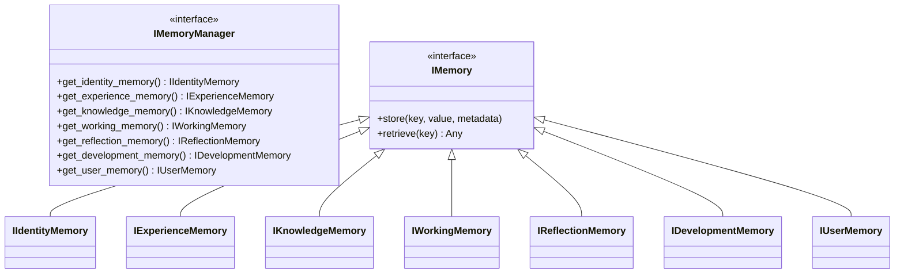
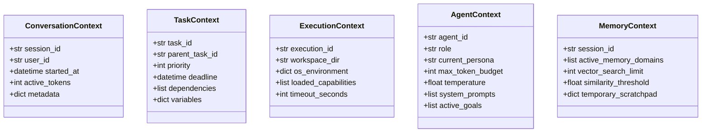

# Vulcan Architecture Specification (VAS)

**Version:** 1.1.0
**Applies to Vulcan Phase:** 1
**Status:** Accepted
**Authors:** Vulcan Core Team & Jules
**Last Updated:** February 2025

---

## 1. Document Overview & Governance

This document serves as the supreme engineering specification and constitutional companion for the Vulcan AI Operating System. All software evolution, package structures, code reviews, and architectural additions must strictly align with the principles, guidelines, and constraints established here.

For the philosophical, ethical, and absolute governance laws of Vulcan, consult the companion document:
*   [The Constitution of the Vulcan AI OS](Constitution.md)

For the precise definition of terms used throughout this document, see:
*   [Vulcan Architectural Glossary](Glossary.md)

---

## 2. Project Vision, Mission & Goals

### 2.1 Project Vision
Vulcan is envisioned as a local-first, highly modular, fully auditable, and extensible AI Operating System. Unlike conversational chatbots or brittle AI agents built as narrow collections of scripts, Vulcan is engineered to act as a resilient system platform that seamlessly integrates intelligence directly into the user’s local workstation environment, coordinating system capabilities, tools, and personalized memories.

### 2.2 Mission
To provide an open-source, highly reliable, and structured platform that augments human capability through autonomous cooperation while preserving the user's ultimate sovereignty, data ownership, and desktop stability.

### 2.3 Long-Term Goals
*   **Zero-Overhead Extensibility**: Make skill and plugin development as easy as dropping a zip file or directory into a folder, supported by dynamic schema validation and explicit capability permission checks.
*   **Bulletproof Visual Responsiveness**: Maintain 60 FPS visual performance for desktop interfaces, running all long-running tasks on dedicated background worker structures, and communicating strictly via timezone-aware, asynchronous hierarchical event streams.
*   **Sacred Memory Preservation**: Build an organized, multi-domain memory framework that records chronological events, builds reflective summaries, and integrates seamlessly with personal knowledge vaults (such as Obsidian) without corrupting or silently pruning user knowledge.
*   **Local Inference Supremacy**: Standardize a model-provider architecture that makes Vulcan fully functional on offline workstation hardware using models orchestrated via Ollama, llama.cpp, or vLLM.

---

## 3. Core Design Philosophy & Engineering Principles

The development of Vulcan is governed by five foundational engineering rules:

1.  **Strict Threading Separation**:
    *   *Rule*: The UI thread (Presentation Layer) must coordinate *exclusively* with PySide6 visual rendering, layouts, and desktop window states.
    *   *Constraint*: No blocking network requests, LLM queries, vector search operations, or relational database transactions are permitted to execute on the main GUI thread. Background workers must handle these processes, dispatching results back to the UI thread via safe Qt Signals or the asynchronous hierarchical Event Bus.
2.  **Interface-First Contractualism (Replaceability)**:
    *   *Rule*: Subsystems must depend solely on stable abstract contracts prefixed with `I` (e.g., `IEventBus`, `IInferenceProvider`, `IMemoryManager`).
    *   *Constraint*: Direct concrete dependency imports across vertical layers are strictly forbidden. Every subsystem must be replaceable through its interface without modifying consuming code.
3.  **Inward-Flowing Layer Rules**:
    *   *Rule*: Dependencies must flow strictly inward/downward (Presentation $\rightarrow$ Orchestration $\rightarrow$ Domain $\rightarrow$ Infrastructure).
    *   *Constraint*: Modules in Infrastructure, Domain, or Orchestration are strictly forbidden from importing modules or symbols from the Presentation Layer (such as `PySide6` or `vulcan.ui.main_window`).
4.  **Constructor Injection Preference**:
    *   *Rule*: Dependencies must be injected via constructors rather than looked up dynamically from service containers inside business logic.
    *   *Constraint*: The `ServiceContainer` is intended for composition root bootstrapping, not as a general-purpose service locator scattered throughout domain models.
5.  **Local-First Resiliency**:
    *   *Rule*: Core operations must remain functional in completely offline, local environments.
    *   *Constraint*: External third-party integrations or cloud models are secondary plugins. The primary workspace, databases (SQLite), vector stores (ChromaDB), and LLMs (Ollama) must operate locally.

---

## 4. Repository Organization & Layer Rules

### 4.1 Folder Structure

Vulcan follows a strict single root package layout under `vulcan/` as shown below:

```
.
├── docs/                      # Architectural, setup, and usage documentation
│   └── architecture/
│       ├── adr/               # Architecture Decision Records
│       ├── Constitution.md    # Philosophical rules and user rights
│       ├── Glossary.md        # Canonical architectural definitions
│       └── Vulcan_Architecture_Specification.md  # [This Document]
├── tests/                     # Test suites (pytest, pytest-qt)
├── vulcan/                    # Main source package namespace
│   ├── agents/                # Agent schemas, Planners, and Lifecycles
│   ├── cognition/             # Cognitive Core: Pipeline, Session, Router, Planner
│   ├── config/                # Layered configuration and override engines
│   ├── core/                  # Service Container, Event/Command Bus, Bootstrappers, and Registries
│   ├── events/                # Event schema definitions
│   ├── memory/                # Structured multi-domain memory interfaces
│   ├── services/              # Chroma DB and Inference provider implementations
│   ├── skills/                # First-party capability modules (e.g., filesystem)
│   ├── ui/                    # Presentation layer UI components (PySide6)
│   └── utils/                 # Structured loggers and shared utilities
├── pyproject.toml             # Poetry/Pip dependencies, black, ruff, mypy, and pytest config
└── README.md                  # Project overview
```

### 4.2 Vertical Layers and Boundaries

Vulcan organizes responsibilities into four distinct vertical layers:

```
  +-------------------------------------------------+
  |              Presentation Layer                 | (UI, CLI, Voice, Speech-to-Text)
  +-----------------------+-------------------------+
                          |
                          v
  +-------------------------------------------------+
  |              Orchestration Layer                | (Planner, Workflow, Agent Tasks, Commands)
  +-----------------------+-------------------------+
                          |
                          v
  +-------------------------------------------------+
  |                 Domain Layer                    | (Memory interfaces, Registry, SkillManifest)
  +-----------------------+-------------------------+
                          |
                          v
  +-------------------------------------------------+
  |             Infrastructure Layer                | (Ollama, SQLite, ChromaDB, Git, Filesystem)
  +-------------------------------------------------+
```

#### A. Presentation Layer
*   **Responsibility**: PySide6 widgets, coordinate storage, window docking, user interactions, notifications, and speech-to-text presentation views.
*   **Rules**:
    *   Extremely thin. Contains no business, planning, or inference rules.
    *   Dispatches commands via the `CommandBus` and observes system occurrences via the `EventBus`.

#### B. Orchestration Layer
*   **Responsibility**: Coordinates task breakdown (Planners), manages agent workflows, schedules long-running command handlers, and manages execution context.
*   **Rules**:
    *   Translates presentation goals into task sequences.
    *   Dispatches tasks down to concrete capabilities.

#### C. Domain Layer
*   **Responsibility**: Defines core business objects, abstract contracts (interfaces prefixed with `I`), capability schemas, permissions, validation rules, and exceptions.
*   **Rules**:
    *   Pure Python and Pydantic types.
    *   **Zero dependencies on PySide6, Qt, relational databases, or network libraries.**

#### D. Infrastructure Layer
*   **Responsibility**: Implementation of Domain contracts using databases (SQLite), vector collections (ChromaDB), local file structures, LLM APIs (Ollama), or external utilities.
*   **Rules**:
    *   Contained entirely behind interfaces. No other layer imports concrete implementation symbols directly.

---

## 5. Subsystem Architecture

### 5.1 Service Container (Implemented)
The service container (`IServiceContainer` in `vulcan/core/container.py`) manages service lifetimes, handles dependency lookup for bootstrapper phases, and registers interface-to-implementation mappings.



*   **Implementation Status**: Fully implemented during Phase 0. Uses constructor-based injection for dependency resolution inside core components.

---

### 5.2 Event Bus (Implemented)
The event bus (`IEventBus` in `vulcan/core/event_bus.py`) coordinates asynchronous, non-blocking notification flows.



*   **Hierarchical Namespace Rules**: Events must be named with hierarchical dot notation (e.g., `System.Started`, `Memory.Stored`, `Skill.File.Deleted`).
*   **Subscription Pattern Matching**: Subscribing to `System.*` will capture `System.Started` and `System.Stopped`.
*   **Implementation Status**: Fully implemented during Phase 0. Thread-safe and supporting pattern-matching subscriptions.

---

### 5.3 Command Bus (Implemented)
Separates notification flows from direct instruction execution:
*   **Purpose**: Processes requests (intent to do work) such as `Command("ExecuteCapability")`.
*   **Handling Rule**: A Command must be routed to exactly *one* handler, which returns a response or a deferred future.
*   **Implementation Status**: Fully integrated with domain-oriented handler mappings during Phase 1.

---

### 5.4 Capability Registry (Implemented)
The registry (`ICapabilityRegistry` in `vulcan/core/registry.py`) maintains a thread-safe map of available operations, tracking which skill package or provider exposes them.



*   **Routing Principle**: Subsystems route work by targeting a registered capability name (e.g., `filesystem.read`) rather than direct file-level class references.
*   **Implementation Status**: Fully implemented in Phase 0.

---

### 5.5 Skill System (Implemented)
Skills are encapsulated directories located under `vulcan/skills/` containing:
*   `manifest.json`: Defines schemas containing `manifest_version` (must be 1 or higher), metadata, exposed capabilities, permissions, and dependencies.
*   `skill.py` / `implementation`: Concrete code exposing a list of executable `ITool` objects.



*   **Implementation Status**: Directory-based loading, parsing, manifest schema validation, and capability mapping are fully implemented in Phase 0.

---

### 5.6 Plugin System (Planned)
*   **Purpose**: Dynamically loads third-party modules from `vulcan/plugins/` to provide integrations with external SaaS tools, hardware utilities, or custom LLMs.
*   **Distinction**: Skills provide capabilities and agent tools inside the core workspace. Plugins extend the core infrastructure of the OS itself (such as alternative database wrappers or specialized event observers).
*   **Implementation Status**: Planned for Phase 1. Discovery will scan configured directories for matching manifests and load python symbols dynamically.

---

### 5.7 Agent Framework (Implemented - Interfaces Only)
*   **Current State**: Phase 0 defines the interfaces and data models in `vulcan/agents/framework.py`:
    *   `Task`: Pydantic data model with ID, Name, Description, and context dependencies.
    *   `ITool`: Interface defining executable tool modules.
    *   `ISkill`: Interface for grouping relevant tools.
    *   `IPlanner`: Interface for generating a plan sequence.
    *   `IAgent`: Interface governing agent execution, status, and task assignments.
*   **Planned Lifecycle**: In Phase 1, all agents must conform to a standardized, state-controlled lifecycle:
    ```
    initialize() -> activate() -> [pause() <-> resume()] -> stop() -> shutdown()
    ```
    This ensures agents are fully discoverable, manageable, and auditable.

---

### 5.8 Memory Architecture (Interfaces Only)
The memory architecture enforces strict separation of storage concerns.



#### Memory Domain Specifications
1.  **Working Memory (`IWorkingMemory`)**: Volatile tracking of active tasks, plans, and execution states.
2.  **Identity Memory (`IIdentityMemory`)**: Stores agent prompt personas, system constants, and cryptographically secure credentials.
3.  **Experience Memory (`IExperienceMemory`)**: Relational timeline tracking past actions, human-machine conversations, and lifecycle transitions.
4.  **Knowledge Memory (`IKnowledgeMemory`)**: Semantic memories, documents, and facts stored as vector embeddings.
5.  **Reflection Memory (`IReflectionMemory`)**: Consolidated summaries and performance feedback loops.
6.  **Development Memory (`IDevelopmentMemory`)**: Codebase indexing, structure mapping, and task tracking.
7.  **User Memory (`IUserMemory`)**: An interface designed strictly to read from and carefully write to the user's permanent, personal Obsidian-backed knowledge vault. This data is sacred; Vulcan must never reorganize or prune this directory without authorization.

*   **Implementation Status**: Phase 0 establishes the abstract contracts in `vulcan/memory/interfaces.py`. Phase 1 will implement the SQLite-backed experience log and ChromaDB-backed knowledge vectors under these interfaces.

---

### 5.9 Model Provider Architecture (Implemented)
*   **Abstraction**: Under no circumstances should the business logic interact with Ollama, OpenAI, or llama.cpp directly. Subsystems must use the `IInferenceProvider` interface.
*   **Ollama Resilience**: The `OllamaProvider` (defined in `vulcan/services/inference.py`) utilizes `httpx` to query endpoints, parses version strings and loaded models, and performs non-blocking health checks, gracefully degrading to an offline state without causing the application to crash.
*   **Implementation Status**: Extended in Phase 1 with strongly typed `InferenceRequest` and `InferenceResponse` capabilities.

---

### 5.10 Cognitive Loop & Routing (New in Phase 1)
All dialogue and planning flows are processed sequentially through a single authoritative pipeline (the Cognitive Loop):
```
User Input -> Session Manager -> Context Assembly -> Prompt Builder -> Inference Provider -> Planner -> Router -> Command Bus -> Capability -> Event Bus -> Session Update -> UI Response
```
*   **Context Gathering**: Orchestrates modular providers returning structured `ContextPiece` objects (Session, Application, Config, Capabilities, Identity).
*   **Deterministic Planning Rules**: User queries are matched against heuristics (like diagnostics or empty input) first, only falling back to an LLM planner if unmatched.

---

### 5.11 UI Philosophy (Implemented)
The Vulcan visual desktop is constructed via PySide6.
*   **Dockable Layout Engine**: The main interface is built using `QDockWidget` objects to enable users to drag, resize, undock, and collapse specific visualization panels (such as chat, file viewer, vector monitor, and log outputs).
*   **State Restoration**: On exit, the application saves the dock states and window geometries via Qt's native `saveState()` and `restoreState()` mechanisms, restoring the exact spatial configuration on subsequent launches.
*   **Implementation Status**: Fully implemented in Phase 0. Tested in `tests/test_ui.py`. Functionalized Conversation panel and diagnostics added in Phase 1.

---

### 5.12 Layered Configuration System (Implemented)
Config properties are parsed and combined according to a strict priority hierarchy:

$$\text{Defaults} \rightarrow \text{Config Files} \rightarrow \text{Environment Variables} \rightarrow \text{Runtime Overrides}$$

*   **Environment Variables**: Prefix matches are resolved (e.g., `VULCAN_MODEL_DEFAULT_MODEL` overrides `ModelConfig.default_model`).
*   **Validation**: Handled via custom structured dataclass containers overlaying values.
*   **Implementation Status**: Fully implemented in `vulcan/config/__init__.py`.

---

### 5.13 Context Architecture (Implemented)
Everything in an AI-native Operating System revolves around managing operational context. To support this, Vulcan introduces a strongly-typed, Pydantic-validated context subsystem in `vulcan/core/context.py` to organize parameters and boundary limits across different scopes:

1.  **Conversation Context (`ConversationContext`)**: Manages chat sessions, user identifiers, last messages, active token counts, and operational metadata.
2.  **Task Context (`TaskContext`)**: Tracks hierarchical task boundaries, execution priorities, deadlines, context dependencies, and active variable maps.
3.  **Execution Context (`ExecutionContext`)**: Records workspace directory paths, system environment variables, loaded capabilities, and execution timeout parameters.
4.  **Agent Context (`AgentContext`)**: Coordinates active agent persona overrides, token budgets, model configuration parameters, system prompts, and active goals.
5.  **Memory Context (`MemoryContext`)**: Controls semantic retrieval thresholds, similarity constraints, vector search limits, scratchpad data, and active memory domains.



*   **Implementation Status**: Fully implemented in Phase 0 as strongly typed Pydantic models. Used by planners, agents, and coordinators to enforce bounds.

---

### 5.14 Logging & Life Log Subsystem (Implemented / Planned)
*   **Application Logs**: Managed via Loguru (`vulcan/utils/logging.py`) with support for console outputs, rotating file backups, and machine-readable JSON structured logs.
*   **Life Log (Planned)**: An architectural component separate from system debugging logs. The Life Log records structured historical milestones (such as plan generations, tool executions, and state transformations), enabling the user to audit and examine the agent's life cycle.
*   **Implementation Status**: Loguru logger is fully implemented. The Life Log persistence system is planned for Phase 1.

---

## 6. Testing Strategy & Quality Standards

*   **Unit Tests**: All core domain, configuration, and infrastructure components must have extensive test coverage written under the `tests/` directory using `pytest`.
*   **UI Testing**: Visual behaviors, widget creation, controller logic, and dock structures must be verified using `pytest-qt` to simulate user interaction without hanging.
*   **Pre-Commit Verification**:
    The repository enforces strict code quality and consistency formatting prior to any branch commit. Developers must run:
    ```bash
    black --check vulcan tests
    ruff check vulcan tests
    mypy vulcan tests
    python -m pytest -k "not test_ui"
    ```
*   **Zero-Dependency Domains**: Ensure that running `mypy` on domain models (`vulcan/core/models.py`) never triggers imports from UI or external database clients.

---

## 7. Future Architectural Constraints & Expansion Guidelines

1.  **Replacing the Model Provider**:
    To integrate an alternative provider (e.g., llama.cpp):
    *   Implement `IInferenceProvider`.
    *   Add a corresponding section in `VulcanConfig`.
    *   Register the new provider class inside the `Bootstrapper` under the `IInferenceProvider` interface in the `ServiceContainer`.
2.  **Developing New Skills**:
    *   Must be placed in a subdirectory under `vulcan/skills/`.
    *   Must contain a valid `manifest.json` carrying `"manifest_version": 1`.
    *   Must implement the `ISkill` interface, declaring tools conforming to `ITool`.
3.  **Extending Memory Subsystems**:
    *   Any alternative storage implementation (e.g., PostgreSQL for long-term vector search) must strictly implement `IKnowledgeMemory` or the appropriate interface.
    *   Consumers must resolve the memory via the central `IMemoryManager`, never directly instantiating the concrete database wrapper.
